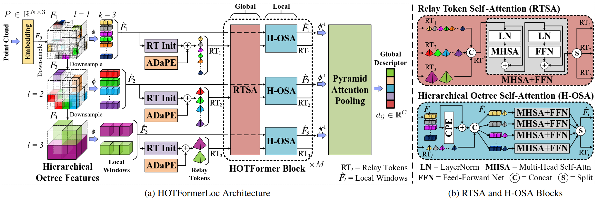

# HOTFormerLoc: Hierarchical Octree Transformer for Versatile Lidar Place Recognition Across Ground and Aerial Views

### What's new ###
* [2025-03-26] Training and evaluation code released. CS-Wild-Places dataset released.

## Description
This is the official repository for the paper:

**HOTFormerLoc: Hierarchical Octree Transformer for Versatile Lidar Place Recognition Across Ground and Aerial Views**, CVPR 2025 by *Ethan Griffiths, Maryam Haghighat, Simon Denman, Clinton Fookes, and Milad Ramezani*\
[[**Website**](https://csiro-robotics.github.io/HOTFormerLoc)] <!-- [[**Paper**](https://cvpr.thecvf.com)] --> [[**arXiv**](https://arxiv.org/abs/2503.08140)] <!-- [[**Video**](https://youtube.com)] --> [[**CS-Wild-Places**](https://data.csiro.au/collection/csiro:64896)]


*HOTFormerLoc Architecture*

We present **HOTFormerLoc**, a novel and versatile **H**ierarchical **O**ctree-based **T**rans**Former** for large-scale 3D place recognition. We propose an octree-based multi-scale attention mechanism that captures spatial and semantic features across granularities, making it suitable for both ground-to-ground and ground-to-aerial scenarios across urban and forest environments.

<!--  -->

In addition, we introduce our novel dataset: [**CS-Wild-Places**](https://data.csiro.au/collection/csiro:64896), a 3D cross-source dataset featuring point cloud data from aerial and ground lidar scans captured in four dense forests. Point clouds in CS-Wild-Places contain representational gaps and distinctive attributes such as varying point densities and noise patterns, making it a challenging benchmark for cross-view localisation in the wild.


*CS-Wild-Places dataset. (Top row) birds eye view of aerial global maps from all four forests. 
(Bottom row) sample ground and aerial submap from each forest.*

Our results demonstrate that HOTFormerLoc achieves a top-1 average recall improvement of 5.5% – 11.5% on the CS-Wild-Places benchmark. Furthermore, it consistently outperforms SOTA 3D place recognition methods, with an average performance gain of 4.9% on well established urban and forest datasets. 

<!--  -->


### Citation
If you find this work useful, please consider citing:
```
@InProceedings{HOTFormerLoc,
	author    = {Griffiths, Ethan and Haghighat, Maryam and Denman, Simon and Fookes, Clinton and Ramezani, Milad},
	title     = {HOTFormerLoc: Hierarchical Octree Transformer for Versatile Lidar Place Recognition Across Ground and Aerial Views},
	booktitle = {Proceedings of the IEEE/CVF Conference on Computer Vision and Pattern Recognition (CVPR)},
	year      = {2025},
}
```
<!-- month     = {todo},
pages     = {todo} -->

## Environment and Dependencies
Code was tested using Python 3.11 with PyTorch 2.1.1 and CUDA 12.1 on a Linux system. We use conda to manage dependencies (although we recommend [mamba](https://mamba.readthedocs.io/en/latest/installation/mamba-installation.html) for a much faster install).

### Installation
```
# Note: replace 'mamba' with 'conda' if using a vanilla conda install
mamba create -n hotformerloc python=3.11 -c conda-forge
mamba activate hotformerloc
mamba install 'numpy<2.0' -c conda-forge
mamba install pytorch==2.1.1 torchvision==0.16.1 pytorch-cuda=12.1 -c pytorch -c nvidia -c conda-forge
pip install -r requirements.txt
pip install libs/dwconv
```

Modify the `PYTHONPATH` environment variable to include the absolute path to the repository root folder (ensure this variable is set every time you open a new shell): 
```export PYTHONPATH
export PYTHONPATH=$PYTHONPATH:<path/to/HOTFormerLoc>
```

## Datasets

### Wild-Places
We train on the Wild-Places dataset introduced in *Wild-Places: A Large-Scale Dataset for Lidar Place Recognition in Unstructured Natural Environments* ([link](https://arxiv.org/pdf/2211.12732)).

Download the dataset [here](https://csiro-robotics.github.io/Wild-Places/#8-Download), and place or symlink the data in `data/wild_places`.

Run the following to fix the broken timestamps in the poses files:
```
cd datasets/WildPlaces
python fix_broken_timestamps.py \
	--root '../../data/wild_places/data/' \
	--csv_filename 'poses.csv' \
	--csv_savename 'poses_fixed.csv' \
	--cloud_folder 'Clouds'

python fix_broken_timestamps.py \
	--root '../../data/wild_places/data/' \
	--csv_filename 'poses_aligned.csv' \
	--csv_savename 'poses_aligned_fixed.csv' \
	--cloud_folder 'Clouds_downsampled'
```

Before network training or evaluation, run the below code to generate pickles with positive and negative point clouds for each anchor point cloud:
```
cd datasets/WildPlaces
python generate_training_tuples.py \
	--root '../../data/wild_places/data/' 

python generate_test_sets.py \
	--root '../../data/wild_places/data/'
```

### CS-Wild-Places
We train on our novel CS-Wild-Places dataset, introduced in further detail in our [paper](https://arxiv.org/abs/2503.08140). CS-Wild-Places is built upon the ground traversals introduced by Wild-Places, so it is required to download the Wild-Places dataset alongside our data.

Download the dataset from [CSIRO's data access portal](https://data.csiro.au/collection/csiro:64896), and place or symlink the data in `data/CS-Wild-Places`. Note that our experiments only require the post-processed submaps, so you can ignore the raw submaps if space is an issue.

Assuming you have followed the above instructions to setup Wild-Places (generating train/test pickles is not required), you can use the below command to post-process the Wild-Places ground submaps into the format required for CS-Wild-Places (set num_workers to a sensible number for your system). Note that this may take several hours depending on your CPU:
```
cd datasets/CSWildPlaces
python postprocess_wildplaces_ground.py \
	--root '../../data/wild_places/data/' \
	--cswildplaces_save_dir '../../data/CS-Wild-Places/postproc_voxel_0.80m_rmground_normalised' \
	--remove_ground \
	--downsample \
	--downsample_type 'voxel' \
	--voxel_size 0.8 \
	--normalise \
	--num_workers XX \
	--verbose
```
Note that this script will generate the submaps used for the results reported in the paper, i.e. voxel downsampled, ground points removed, and normalised. We also provide a set of unnormalised submaps for convenience, and the corresponding Wild-Places ground submaps can be generated by omitting the `--normalise` option, and by setting `--cswildplaces_save_dir` to `'../../data/CS-Wild-Places/postproc_voxel_0.80m_rmground'`.

Before network training or evaluation, run the below code to generate pickles with positive and negative point clouds for each anchor point cloud:

```
cd datasets/CSWildPlaces
python generate_train_test_tuples.py \
	--root '../../data/CS-Wild-Places/postproc_voxel_0.80m_rmground_normalised/' \
	--eval_thresh '30' \
	--pos_thresh '15' \
	--neg_thresh '60' \
	--buffer_thresh '30' \
	--v2_only
```
Note that training and evaluation pickles are saved to the directory specified in `--root` by default. 

### CS-Campus3D
We train on the CS-Campus3D dataset introduced in *CrossLoc3D: Aerial-Ground Cross-Source 3D Place Recognition* ([link](https://arxiv.org/pdf/2303.17778)).

Download the dataset [here](https://drive.google.com/file/d/1yxVicykRMg_HAfZG2EQUl1R3_wxpxStd/view?usp=sharing), and place or symlink the data in `data/benchmark_datasets_cs_campus3d`. 

Run the below commands to convert the CS_Campus3D train and test pickles into a suitable format for use with HOTFormerLoc.

```
cd datasets/CSCampus3D
python save_queries_HOTFormerLoc_format.py
```

### Oxford RobotCar
We trained on a subset of Oxford RobotCar and the In-house (U.S., R.A., B.D.) datasets introduced in
*PointNetVLAD: Deep Point Cloud Based Retrieval for Large-Scale Place Recognition* ([link](https://arxiv.org/pdf/1804.03492)).
There are two training datasets:
- Baseline Dataset - consists of a training subset of Oxford RobotCar
- Refined Dataset - consists of training subset of Oxford RobotCar and training subset of In-house

We report results on the Baseline set in the paper.

For dataset description see the PointNetVLAD paper or github repository ([link](https://github.com/mikacuy/pointnetvlad)).

You can download the dataset from 
[here](https://drive.google.com/open?id=1rflmyfZ1v9cGGH0RL4qXRrKhg-8A-U9q) 
([alternative link](https://drive.google.com/file/d/1-1HA9Etw2PpZ8zHd3cjrfiZa8xzbp41J/view?usp=sharing)), then place or symlink the data in `data/benchmark_datasets`.

Before network training or evaluation, run the below code to generate pickles with positive and negative point clouds for each anchor point cloud. 

```generate pickles
cd datasets/pointnetvlad 

# Generate training tuples for the Baseline Dataset
python generate_training_tuples_baseline.py --dataset_root '../../data/benchmark_datasets'

# (Optionally) Generate training tuples for the Refined Dataset
python generate_training_tuples_refine.py --dataset_root '../../data/benchmark_datasets'

# Generate evaluation tuples
python generate_test_sets.py --dataset_root '../../data/benchmark_datasets'
```

## Training
To train **HOTFormerLoc**, download the datasets and generate training pickles as described above for any dataset you wish to train on. 
The configuration files for each dataset can be found in `config/`. 
Set the `dataset_folder` parameter to the dataset root folder (only necessary if you have issues with the default relative path).
If running out of GPU memory, decrease `batch_split_size` and `val_batch_size` parameter value. If running out of RAM, you may need to decrease the `batch_size` parameter or try reducing `num_workers` to 1, but note that a smaller batch size may slightly reduce performance. We use wandb for logging by default, but this can be disabled in the config.

To train the network, run:

```
cd training

# To train HOTFormerLoc on CS-Wild-Places
python train.py --config ../config/config_cs-wild-places.txt --model_config ../models/hotformerloc_cs-wild-places_cfg.txt

# To train HOTFormerLoc on Wild-Places
python train.py --config ../config/config_wild-places.txt --model_config ../models/hotformerloc_wild-places_cfg.txt

# To train HOTFormerLoc on CS-Campus3D
python train.py --config ../config/config_cs-campus3d.txt --model_config ../models/hotformerloc_cs-campus3d_cfg.txt

# To train HOTFormerLoc on Oxford RobotCar
python train.py --config ../config/config_oxford.txt --model_config ../models/hotformerloc_oxford_cfg.txt
```

If training on a SLURM cluster, we provide the `submitit_train_job_single_node.py` script to automate training job submission, with support for automatic checkpointing and resubmission on job timeout. Make sure to set job parameters appropriately for your cluster.

### Pre-trained Weights

Pre-trained weights for HOTFormerLoc and other experiments can be downloaded and placed in the `weights` directory. You can download them individually below, or download and extract all from [this link](https://www.dropbox.com/scl/fi/qjyh966styqlye38a4c37/pretrained_weights.tar.gz?rlkey=qkuhupf3og7mfkfid8dts7xej&st=wx8q2v68&dl=0).
| Model        | Dataset         | Weights Download                                                                                                                                                         |
|--------------|-----------------|--------------------------------------------------------------------------------------------------------------------------------------------------------------------------|
| HOTFormerLoc | CS-Wild-Places  | [hotformerloc_cs-wild-places.pth](https://www.dropbox.com/scl/fi/bcgcmbyic591f3bviib64/hotformerloc_cs-wild-places.pth?rlkey=vrw0seq6nfbsihijbhqatll2u&st=d7enawjw&dl=0) |
| HOTFormerLoc | CS-Campus3D     | [hotformerloc_cs-campus3D.pth](https://www.dropbox.com/scl/fi/l9jyn5310gjf80zw35v7z/hotformerloc_cs-campus3d.pth?rlkey=s0bpcysyc1xt2357shhclpnlw&st=zhh679b9&dl=0)       |
| HOTFormerLoc | Wild-Places     | [hotformerloc_wild-places.pth](https://www.dropbox.com/scl/fi/yd94iy9dq6k1m312ifnyx/hotformerloc_wild-places.pth?rlkey=5ndv0p48c7hyjvah90eab1l1e&st=zl1716hh&dl=0)       |
| HOTFormerLoc | Oxford RobotCar | [hotformerloc_oxford.pth](https://www.dropbox.com/scl/fi/4r3470zo9zomkyjys5nrm/hotformerloc_oxford.pth?rlkey=eocfo3yvmhuqqgsmjtypgf78s&st=ybhzcj6y&dl=0)                 |
| MinkLoc3Dv2  | CS-Wild-Places  | [minkloc3dv2_cs-wild-places.pth](https://www.dropbox.com/scl/fi/2w4l8gv7qbmp0lh4eztsf/minkloc3dv2_cs-wild-places.pth?rlkey=udxvtkr6yfgdnyizra4gmw0qa&st=p0evrh61&dl=0)   |
| CrossLoc3D   | CS-Wild-Places  | [crossloc3d_cs-wild-places.pth](https://www.dropbox.com/scl/fi/5ikt1jvr2fabiaw8mhqbb/crossloc3d_cs-wild-places.pth?rlkey=lb4gp2n814im3twy4zy5d67bd&st=znup5ewi&dl=0)     |
| LoGG3D-Net   | CS-Wild-Places  | [logg3dnet_cs-wild-places.pth](https://www.dropbox.com/scl/fi/51se5akdyg35xy2dsrosj/logg3dnet_cs-wild-places.pth?rlkey=4nvvp8gw656wdbj3081jzcn0i&st=n5ytpnzc&dl=0)       |

## Evaluation

To evaluate the pretrained models run the following commands:

```
cd eval

# To evaluate HOTFormerLoc trained on CS-Wild-Places
python pnv_evaluate.py --config ../config/config_cs-wild-places.txt --model_config ../models/hotformerloc_cs-wild-places_cfg.txt --weights ../weights/hotformerloc_cs-wild-places.pth

# To evaluate HOTFormerLoc trained on Wild-Places
python pnv_evaluate.py --config ../config/config_wild-places.txt --model_config ../models/hotformerloc_wild-places_cfg.txt --weights ../weights/hotformerloc_wild-places.pth

# To evaluate HOTFormerLoc trained on CS-Campus3D
python pnv_evaluate.py --config ../config/config_cs-campus3d.txt --model_config ../models/hotformerloc_cs-campus3d_cfg.txt --weights ../weights/hotformerloc_cs-campus3d.pth

# To evaluate HOTFormerLoc trained on Oxford RobotCar
python pnv_evaluate.py --config ../config/config_oxford.txt --model_config ../models/hotformerloc_oxford_cfg.txt --weights ../weights/hotformerloc_oxford.pth
```

Below are the results for all evaluated models on CS-Wild-Places:


*Comparison of SOTA on CS-Wild-Places Baseline evaluation set.*


*Comparison of SOTA on CS-Wild-Places Unseen evaluation set.*

See the paper for full results and comparison with SOTA on all datasets.

## Acknowledgements

Special thanks to the authors of [MinkLoc3Dv2](https://github.com/jac99/MinkLoc3Dv2) and [OctFormer](https://github.com/octree-nn/octformer) for their excellent code, which formed the foundation of this codebase. We would also like to thank the authors of [Wild-Places](https://csiro-robotics.github.io/Wild-Places/) for their fantastic dataset which serves as the base that CS-Wild-Places is built upon.
